# VibeWing

<p align="center">
  
</p>

<p align="center"><strong>Give your projects wings.</strong></p>

<p align="center">
  A visual desktop workspace for running, diagnosing, building, and shipping local projects—without living in the terminal.
</p>

<p align="center">
  English · <a href="#中文说明">简体中文</a>
</p>

## Why VibeWing?

Vibe coding makes creating software easier, but the surrounding work still often requires terminal knowledge: starting separate frontend and backend services, finding ports, reading logs, building releases, and operating Git. VibeWing allowing you to start, restart, stop, build, inspect logs, and manage Git without repeatedly asking your Coding Agent to run terminal commands,puts those repeatable tasks into one desktop workspace so your Coding Agent can focus on code.

## Download and install

Open [GitHub Releases](https://github.com/Grakie93/VibeWing/releases/latest), expand **Assets**, and download the application for your operating system. Do not download the automatically generated **Source code** archives unless you want to develop VibeWing.

### macOS

1. Check your Mac architecture from **Apple menu → About This Mac**.
2. Download the matching macOS `.dmg` or `.zip` from **Assets**.
3. If using a `.dmg`, open it and drag **VibeWing** into **Applications**. If using a `.zip`, extract it and move **VibeWing.app** into **Applications**.
4. Open **Applications**, Control-click **VibeWing**, choose **Open**, then confirm **Open** if macOS reports that the developer cannot be verified.
5. VibeWing opens directly; Python is not required for the application itself.

### Windows

1. Download the Windows `.exe` from **Assets**. The installer build is recommended; the portable build runs without installation.
2. Double-click the installer, choose an installation directory, and finish setup.
3. Launch VibeWing from the desktop or Start menu.
4. If Microsoft Defender SmartScreen shows **Windows protected your PC**, first verify that the file came from the official `Grakie93/VibeWing` Releases page, then choose **More info → Run anyway**.
5. VibeWing opens directly; Python is not required for the application itself.

> VibeWing includes its own local backend, but your imported projects still need their own runtimes and dependencies. For example, Node projects need Node.js and installed packages; Python projects need their project environment.

### Ask your Coding Agent to help install

Copy this prompt to your Coding Agent if you prefer guided installation:

```text
Help me install VibeWing from the official GitHub repository:
https://github.com/Grakie93/VibeWing

1. Identify my operating system and CPU architecture.
2. Open the latest GitHub Release and tell me exactly which file under Assets to download.
3. Do not use the Source code archives.
4. Guide me through installing and opening the application.
5. Explain any unsigned-application warning, but do not bypass security checks without my confirmation.
6. After VibeWing opens, help me identify my project's frontend and backend directories, start commands, and ports so I can import it.
```

### Import projects automatically with the VibeWing Skill (v2 / Tauri)

Instead of filling in commands and ports by hand, let your Coding Agent write a project JSON straight into VibeWing's data folder. VibeWing (v2 / Tauri edition) reads that folder on launch and when you click **Rescan** (重新扫描), so the project shows up ready to start with one click.

**Send your Coding Agent this link** (it is the full skill spec):

```text
https://raw.githubusercontent.com/Grakie93/VibeWing/main/vibewing-import.md
```

Or paste this prompt:

```text
请阅读并按照下面这个 VibeWing 导入规范，把当前项目导入 VibeWing：
https://raw.githubusercontent.com/Grakie93/VibeWing/main/vibewing-import.md
```

The agent inspects your repo (`package.json`, `requirements.txt`, etc.), then writes `<name>.json` into VibeWing's projects folder:

- macOS: `~/Library/Application Support/app.vibewing.tauri.dev/projects/`
- Windows: `%APPDATA%\app.vibewing.tauri.dev\projects\`
- Linux: `~/.local/share/app.vibewing.tauri.dev/projects/`

Open VibeWing and click **Rescan** (重新扫描); the project appears and can be started immediately.

## Screenshots

### Project dashboard

Manage separate frontend and backend services, ports, builds, logs, and Git from one workspace.

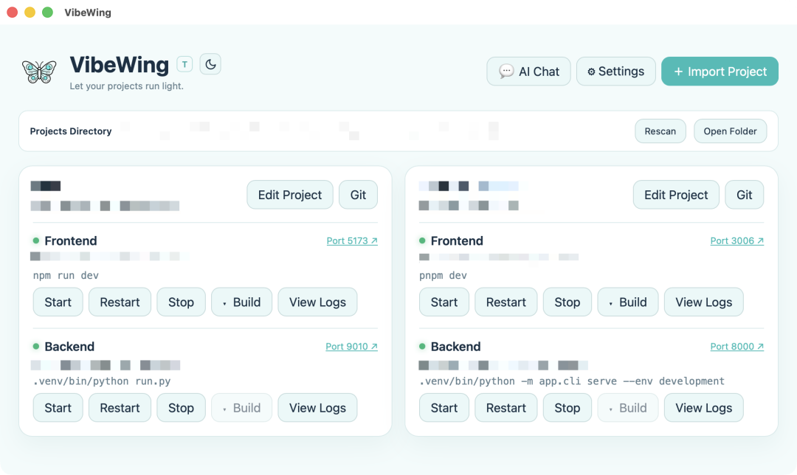

### Import a project

Set the Git root, frontend/backend working directories, start commands, and ports for split or full-stack projects.

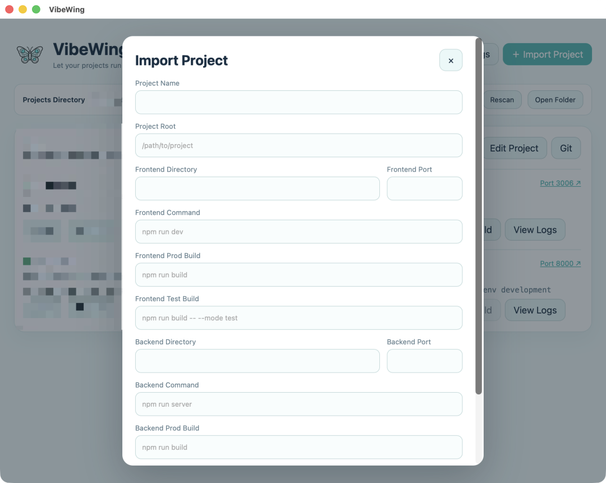

### View logs and ask AI

Inspect live output without a terminal. Select only the relevant log lines, then copy them or attach them to AI Chat for first-pass diagnosis.

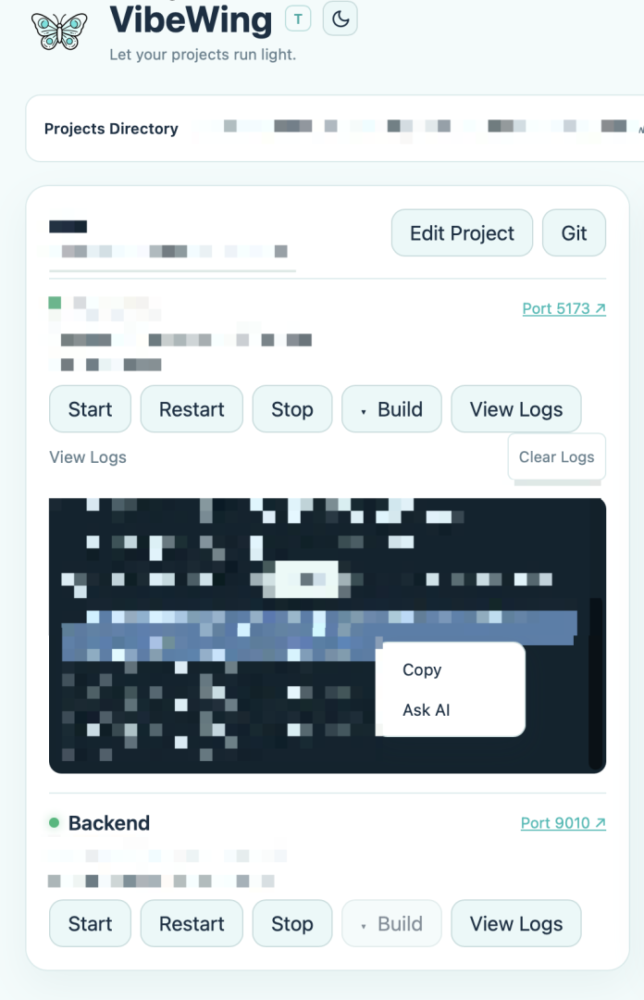

### AI Chat

Keep multiple independent conversations, attach project or log context, switch models, and continue working while a response is generated.

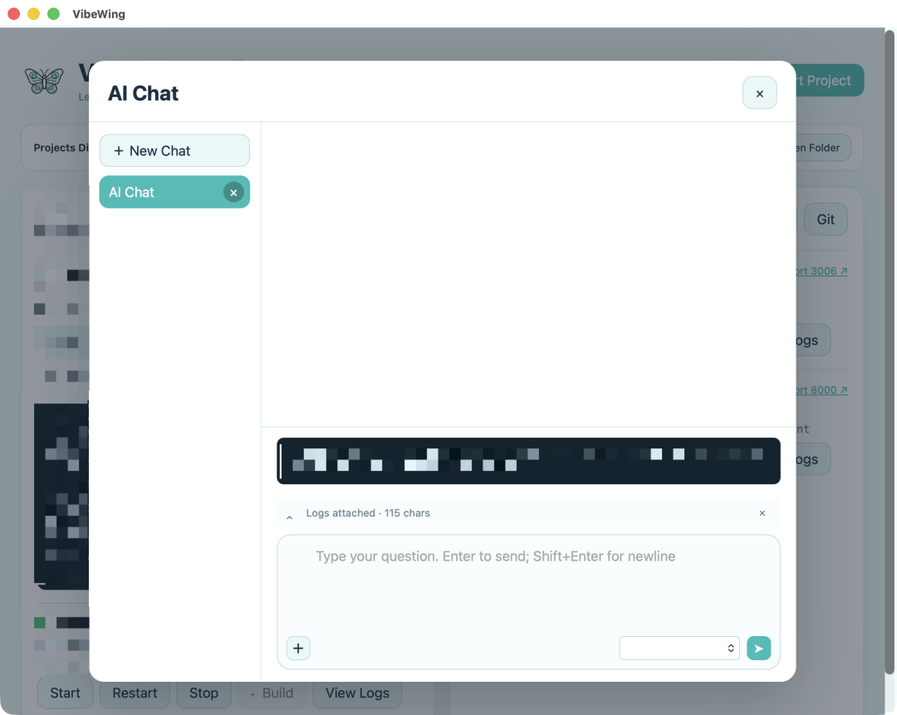

### Model providers

Connect an OpenAI-compatible provider with its API URL, API key, and official model ID. VibeWing does not ship with a preconfigured provider or model.

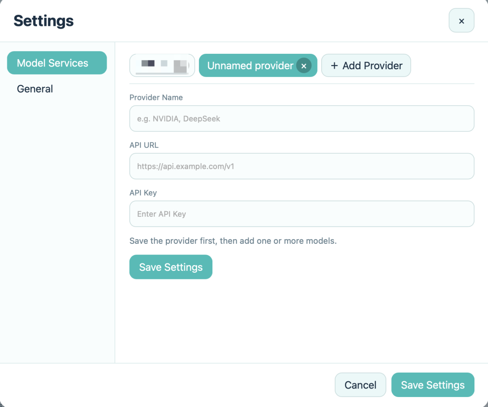

### Visual Git workflow

Switch or pull branches, select changed files, stage them, generate a Conventional Commit message, commit locally, and push the current branch.

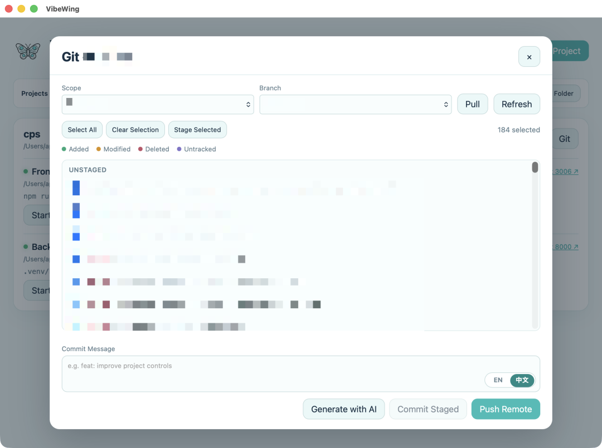

### Light and dark themes

Use the built-in light or dark theme, or customize the accent, background, and card colors.

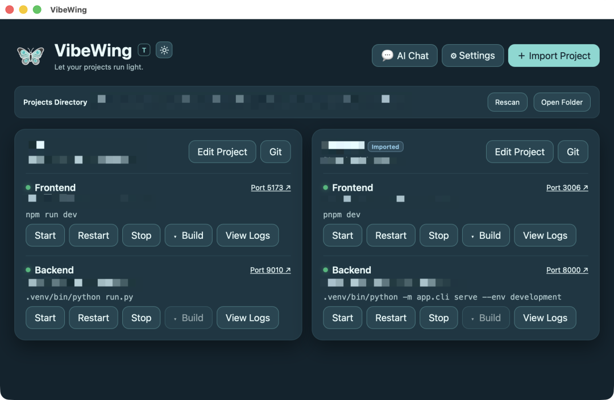

## Features

- Import and manage multiple local projects.
- Configure separate frontend and backend directories, commands, and ports.
- Start, restart, and stop services with visible running states.
- Inspect live logs without opening a terminal.
- Build production or test frontend bundles from detected `package.json` scripts.
- Select files, stage or unstage them, switch branches, pull, commit, and push with a visual Git workflow.
- Generate English and Chinese Conventional Commit messages with AI.
- Attach project context or selected logs to AI Chat for first-pass diagnosis.
- Connect NVIDIA NIM or another OpenAI-compatible Chat Completions API.
- Keep multiple conversations, choose a default model, switch language, and customize themes.
- Check GitHub Releases at most once per day and notify you when a newer stable version is available. This can be disabled in General Settings.
- Run on macOS and Windows with an embedded VibeWing backend—users do not need Python to run VibeWing itself.

## First use

### 1. Add an AI provider (optional)

Open **Settings → Model Services → Add Provider** and enter:

- **Provider name**: any display name, such as NVIDIA or DeepSeek.
- **API URL**: an OpenAI-compatible base URL ending in `/v1` when required by the provider.
- **API Key**: the key issued by that provider.
- **Model ID**: the provider's exact official ID, such as `openai/gpt-oss-20b`.
- **Display name**: an optional friendly name shown in VibeWing.

AI is optional. Project running, logs, building, and Git actions do not require an AI provider. Model availability and capabilities are controlled by each provider and may change over time.

### 2. Import a project

Click **Import Project**, then configure:

- **Project root**: the default Git repository directory.
- **Frontend directory**: the folder containing the frontend `package.json`.
- **Frontend command and port**: for example `npm run dev` and `5173`.
- **Backend directory**: the folder containing the backend application.
- **Backend command and port**: for example `python manage.py runserver` and `8000`.

For a full-stack project that uses one directory, use the same root where appropriate. VibeWing executes the commands you configure in those working directories.

#### Ask your Coding Agent to identify the project configuration

If you are unsure what to enter, open the project in your Coding Agent and copy the prompt below. The agent should inspect the actual files and return values that you can paste directly into VibeWing.

```text
Please inspect this project and tell me exactly how to configure it in VibeWing.

Read the actual project files first, including package.json scripts, lockfiles,
README files, environment examples, backend entry points, and framework config.
Do not guess values that cannot be confirmed from the repository.

Return the following fields in this exact order, with one copyable value per field:

1. Project name
2. Project root (the Git repository root, as an absolute path)
3. Frontend working directory (absolute path; use the project root if shared)
4. Frontend start command (leave empty if there is no frontend)
5. Frontend port (leave empty if it is assigned dynamically)
6. Backend working directory (absolute path; use the project root if shared)
7. Backend start command (leave empty if there is no backend)
8. Backend port (leave empty if it is assigned dynamically)

Requirements:
- Use commands that are already defined or documented by this project.
- Use the package manager indicated by the lockfile.
- Do not install dependencies, edit files, or start the project unless I ask.
- On Windows, paths must include the drive letter, for example
  D:\Projects\MyApp. Preserve backslashes in the values I should paste.
- On macOS and Linux, use absolute paths beginning with /.
- If frontend and backend are separate, identify both directories independently.
- After the eight fields, briefly explain which files proved each command and port.
```

### 3. Run and diagnose

Use **Start**, **Restart**, and **Stop** from the project card. Open **View Logs** to inspect output. Select a relevant portion of a log and choose **Ask AI** to attach it to a conversation, or copy it for another coding assistant.

### 4. Use source control

Open **Git** from the project card:

1. Choose the frontend or backend repository when they are different.
2. Select changed files and stage them.
3. Write a commit message or generate one with AI.
4. Choose **Commit Staged** for a local commit.
5. Choose **Push Remote** when you are ready to publish the current branch.

Pull uses fast-forward-only mode to avoid VibeWing silently creating merge commits. Existing Git authentication is handled by the user's Git installation and credential helper.

### 5. Scan the projects directory (Rescan)

VibeWing (v2 / Tauri edition) keeps watching a dedicated **projects directory** for drop-in `*.json` files. Each file becomes one imported project, addressed by `file:<filename-stem>`, and is kept separate from projects you author directly in the UI.

- Open the directory with **Open Folder** (打开目录) on the data bar. Its location is:
  - macOS: `~/Library/Application Support/app.vibewing.tauri.dev/projects/`
  - Windows: `%APPDATA%\app.vibewing.tauri.dev\projects\`
  - Linux: `~/.local/share/app.vibewing.tauri.dev/projects/`
- After your Coding Agent (or you) drops a `<name>.json` into that directory, click **Rescan** (重新扫描) on the data bar. VibeWing reads every `*.json` and shows the new project, ready to start with one click.
- To remove a file-sourced project, delete its `*.json` from the directory, then click **Rescan**; the project disappears from the workspace.

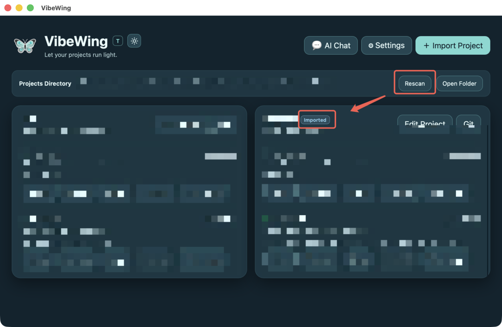

## Build script detection

For frontend builds, VibeWing currently checks these scripts in order:

| Environment | Detected scripts |
| --- | --- |
| Production | `build:prod`, `build:production`, `build` |
| Test | `build:test`, `build:staging`, `test:build` |

The package manager is inferred from the lockfile (`pnpm`, Yarn, Bun, or npm). Build output stays in the location defined by the project's own build configuration.

## Data, privacy, and security

VibeWing runs a local backend bound to `127.0.0.1` and protects its API with a random token generated for each launch.

Application data is stored per user:

- macOS: `~/Library/Application Support/VibeWing`
- Windows: `%APPDATA%\VibeWing`

Project configuration, settings, conversations, and logs remain local unless you explicitly send project context or logs to an AI provider. Those AI requests are sent directly to the provider URL you configured and are subject to that provider's privacy and retention terms.

When automatic update checks are enabled, VibeWing accesses the public GitHub Releases API at most once per day only to retrieve the latest stable version and release notes. No project data is sent.

On macOS, API keys are stored in Keychain. On Windows, they are encrypted with Windows Data Protection API (DPAPI) for the current Windows user and persist across VibeWing restarts. Configuration exports never include API keys.

Logs can contain private source paths, environment output, URLs, or access tokens printed by a project. Review selected logs before sending them to an AI provider or sharing them in an issue.

VibeWing can execute configured shell commands and Git operations on local repositories. Import only projects you trust and review commands before running them.

## Troubleshooting

### A service does not start

- Confirm the configured working directory exists.
- On Windows, use a complete absolute path including the drive letter, such as `D:\Projects\MyApp`.
- For npm, pnpm, Yarn, or Bun commands, confirm that directory contains `package.json`.
- Run the project's dependency installation once if needed.
- Check **View Logs** for the command, exit code, and error output.
- Confirm the configured port is not already used by another process.

### A build is unavailable

Check that the frontend `package.json` contains one of the scripts listed in [Build script detection](#build-script-detection). VibeWing does not invent or modify build scripts automatically.

### AI requests fail or are slow

- Verify the provider URL, API key, and exact model ID.
- Confirm the model still exists and supports Chat Completions.
- Try another model when the provider returns `410`, `502`, `503`, or `504`.
- Reasoning models can take considerably longer before producing visible output.

### Git push fails

- Confirm an `origin` remote exists.
- Confirm your Git credential helper or SSH key works outside VibeWing.
- Pull the latest changes first when the remote branch has advanced.

## Development

Requirements:

- Node.js 22 or later
- Python 3.12 or later
- Git

```bash
git clone https://github.com/Grakie93/VibeWing.git
cd VibeWing
npm ci
python3 -m pip install -r requirements-build.txt
npm start
```

Local development data files are intentionally ignored by Git. Do not force-add `projects.json`, `settings.json`, `chats.json`, `logs/`, `.env` files, certificates, or signing keys.

## Build desktop packages

Build on the target operating system:

```bash
# macOS
npm run dist:mac

# Windows
npm run dist:win
```

Artifacts are written to `dist/`. The packaged application contains the PyInstaller-built local backend, so end users do not need Python for VibeWing itself.

## Contributing

Issues and pull requests are welcome. For bug reports, include:

- Operating system and VibeWing version.
- The type of project and package manager.
- Reproduction steps and expected behavior.
- Sanitized logs with credentials, access tokens, private URLs, and personal paths removed.

Read [CONTRIBUTING.md](CONTRIBUTING.md) before submitting changes. Contributions are accepted under the repository's MIT License.

## Community and support

- Use [GitHub Discussions](https://github.com/Grakie93/VibeWing/discussions) for ideas, questions, and general feedback.
- Use [GitHub Issues](https://github.com/Grakie93/VibeWing/issues) for reproducible bugs and confirmed feature work.
- Follow [CONTRIBUTING.md](CONTRIBUTING.md) before opening a pull request.
- Report sensitive security problems through GitHub's private vulnerability reporting channel.
- Contact: [grakie93@gmail.com](mailto:grakie93@gmail.com).

## License

VibeWing source code is licensed under the [MIT License](LICENSE).

Copyright © 2026 Grakie93. The MIT license covers the source code, not permission to present an unofficial fork as the official VibeWing product. See [Brand Guidelines](BRAND_GUIDELINES.md). Third-party components retain their respective licenses; see [Third-Party Notices](THIRD_PARTY_NOTICES.md).

---

## 中文说明

**让您的项目轻盈运行。**

VibeWing 是面向 Vibe Coding 用户的跨平台桌面工作台，把本地项目的前后端启动、重启、停止、端口、日志、构建和 Git 工作流集中到一个可视化界面中，让 Coding Agent 更专注于编写和修复代码。

## 为什么选择 VibeWing？

Vibe Coding 让开发软件变得更容易，但项目周边工作通常仍然需要终端知识：启动相互独立的前后端服务、查找端口、阅读日志、构建产物，以及操作 Git。VibeWing 让你无需反复要求 Coding Agent 执行终端命令，即可启动、重启、停止、构建项目、查看日志和管理 Git，把这些重复工作集中到一个桌面工作台，让你的 Coding Agent 专注于编写和修复代码。

## 下载与安装

打开 [GitHub Releases](https://github.com/Grakie93/VibeWing/releases/latest)，展开 **Assets**，下载与你的系统和 CPU 架构匹配的安装包。不要下载 GitHub 自动生成的 **Source code** 压缩包。

### macOS

1. 点击苹果菜单中的“关于本机”，确认 Mac 使用 Apple 芯片还是 Intel 芯片。
2. 在 **Assets** 中下载对应的 `.dmg` 或 `.zip`。
3. `.dmg` 用户打开镜像后，将 VibeWing 拖入“应用程序”；`.zip` 用户解压后，将 `VibeWing.app` 移入“应用程序”。
4. 进入“应用程序”，按住 Control 点击 VibeWing，选择“打开”。如果系统提示无法验证开发者，再确认一次“打开”。
5. VibeWing 可直接运行，软件本身不需要另外安装 Python。

### Windows

1. 在 **Assets** 中下载 Windows `.exe`。普通用户建议下载安装版；便携版无需安装即可运行。
2. 双击安装包，选择安装目录并完成安装。
3. 从桌面或开始菜单启动 VibeWing。
4. 如果 SmartScreen 显示“Windows 已保护你的电脑”，请先确认文件来自官方 `Grakie93/VibeWing` Releases 页面，再点击“更多信息 → 仍要运行”。
5. VibeWing 可直接运行，软件本身不需要另外安装 Python。

VibeWing 自身不要求用户安装 Python，但不会替项目安装运行环境。Node 项目仍需 Node.js 和依赖，Python 项目仍需项目自己的 Python 环境。

### 让 Coding Agent 帮你安装

如果希望让 Coding Agent 手把手指导，可以复制下面这段话：

```text
请帮我从 VibeWing 官方 GitHub 仓库安装软件：
https://github.com/Grakie93/VibeWing

1. 先确认我的操作系统和 CPU 架构。
2. 打开最新的 GitHub Release，告诉我应该下载 Assets 里的哪一个文件。
3. 不要下载 Source code 压缩包。
4. 手把手指导我完成安装并打开应用。
5. 如果出现未签名应用警告，请解释原因，但未经我确认不要绕过安全提示。
6. 打开 VibeWing 后，帮我识别项目的前后端目录、启动命令和端口，方便我导入项目。
```

### 用 VibeWing Skill 让 Coding Agent 自动导入项目（v2 / Tauri）

不想手填命令和端口？可以让你的 Coding Agent 直接把项目 JSON 写进 VibeWing 的数据目录。VibeWing（v2 / Tauri 版）在启动和点「重新扫描」时会读取该目录，项目随即出现，一键即可启动。

**把下面这个链接直接发给你的 Coding Agent**（这就是完整的导入规范）：

```text
https://raw.githubusercontent.com/Grakie93/VibeWing/main/vibewing-import.md
```

或者粘贴这段提示词：

```text
请阅读并按照下面这个 VibeWing 导入规范，把当前项目导入 VibeWing：
https://raw.githubusercontent.com/Grakie93/VibeWing/main/vibewing-import.md
```

Agent 会检查你的仓库（`package.json`、`requirements.txt` 等），然后把 `<name>.json` 写入 VibeWing 的项目目录：

- macOS：`~/Library/Application Support/app.vibewing.tauri.dev/projects/`
- Windows：`%APPDATA%\app.vibewing.tauri.dev\projects\`
- Linux：`~/.local/share/app.vibewing.tauri.dev/projects/`

打开 VibeWing 点「重新扫描」即可看到项目，直接启动。

## 功能截图

### 项目管理总览

在一个工作台中管理独立的前后端服务、端口、构建、日志和 Git。

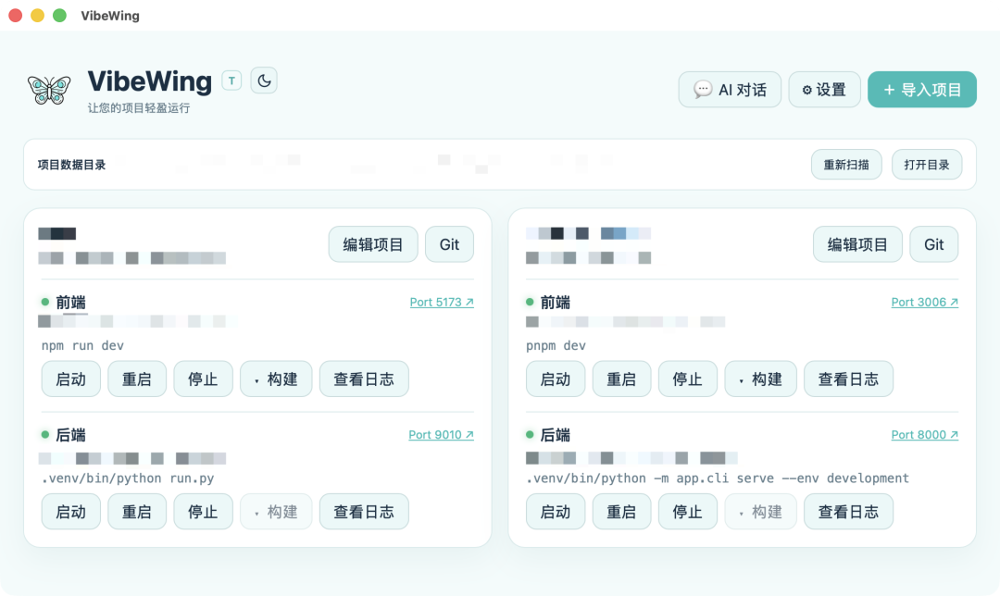

### 导入项目

为前后端分离项目或全栈项目设置 Git 主目录、前后端工作目录、启动命令和端口。

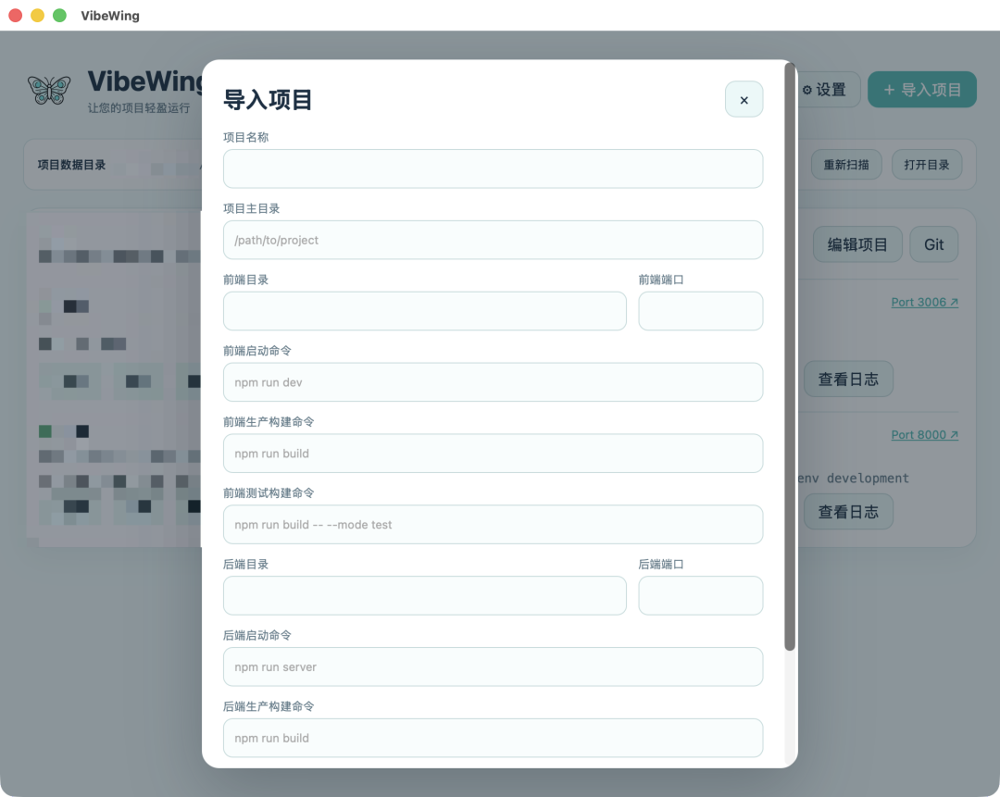

### 查看日志并问 AI

无需打开终端即可查看实时输出。只选中相关日志，再进行复制或将其附加到 AI 对话中做初步诊断。

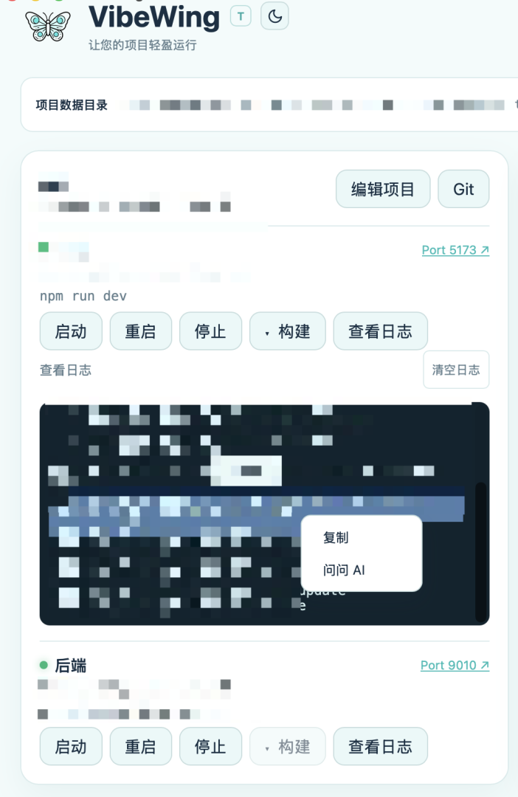

### AI 对话

保留多个独立对话，附加项目或日志上下文，切换模型，并在模型生成回答时继续处理其他工作。

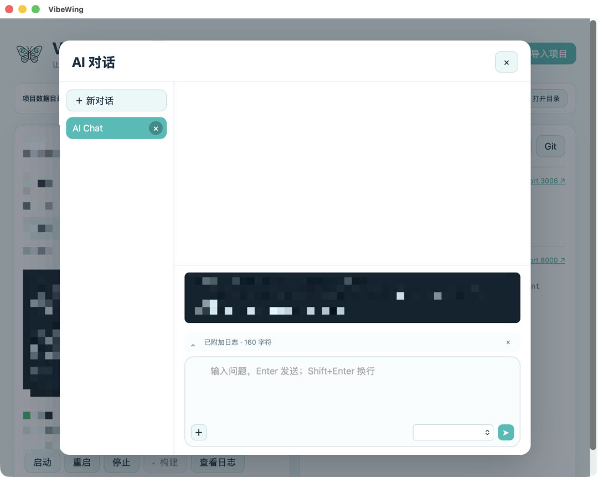

### 模型平台

使用 API 地址、API Key 和官方模型 ID 接入兼容 OpenAI 格式的平台。VibeWing 不会预置任何平台或模型。

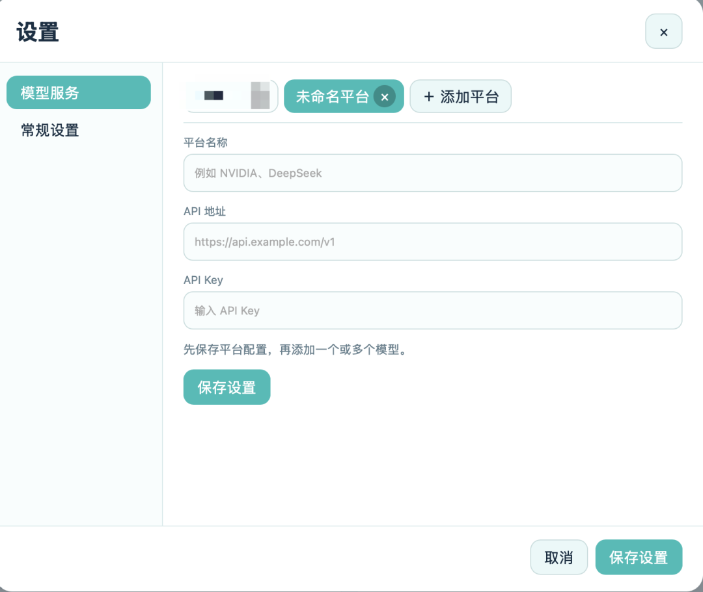

### 可视化 Git 工作流

切换或拉取分支、选择变更文件、暂存文件、生成 Conventional Commit 提交信息、本地提交并推送当前分支。

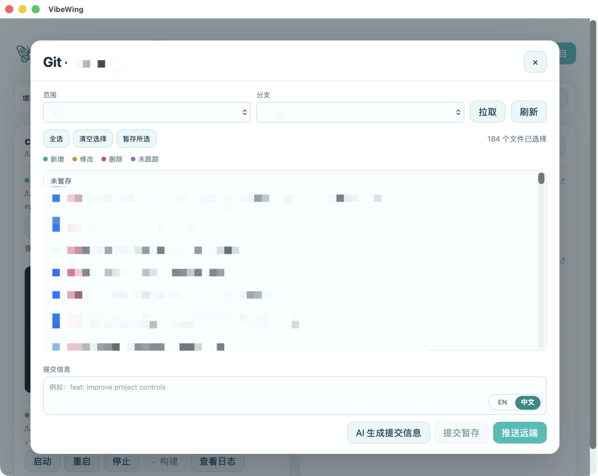

### 浅色与深色主题

使用内置浅色或深色主题，也可以自定义主色、背景色和卡片色。

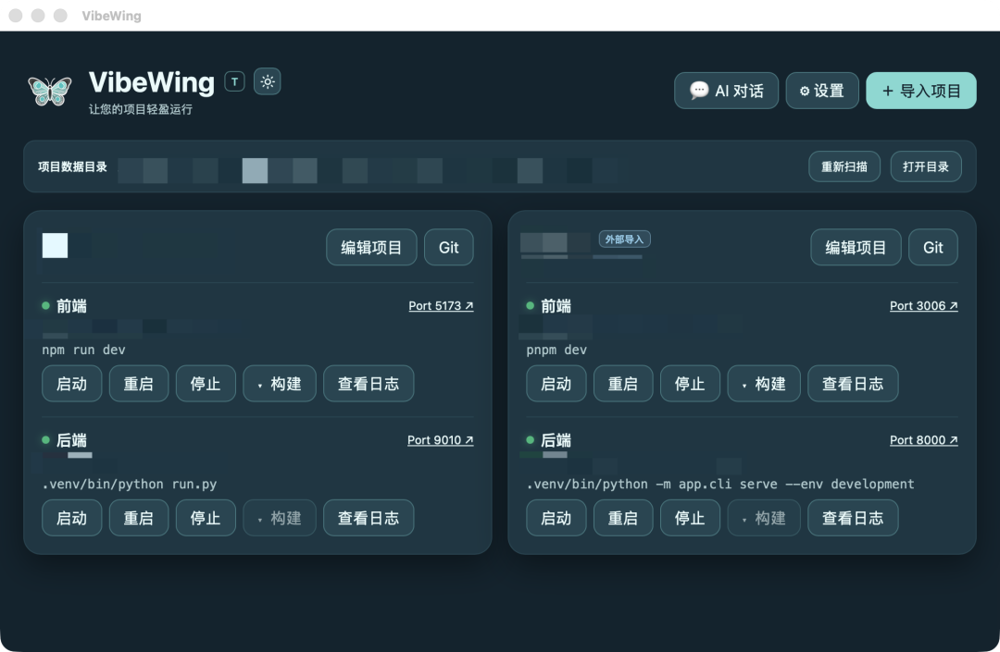

## 主要功能

- 导入和管理多个本地项目。
- 分别配置前端和后端目录、命令及端口。
- 启动、重启和停止服务，并显示清晰的运行状态。
- 无需打开终端即可查看实时日志。
- 根据 `package.json` 中检测到的脚本构建生产或测试环境的前端产物。
- 在可视化 Git 工作流中选择文件、暂存或取消暂存、切换分支、拉取、提交和推送。
- 使用 AI 生成中英文 Conventional Commit 提交信息。
- 将项目上下文或选中的日志附加到 AI 对话，进行初步诊断。
- 接入 NVIDIA NIM 或其他兼容 OpenAI Chat Completions 格式的 API。
- 保存多个对话、选择默认模型、切换软件语言并自定义主题。
- 每天最多访问一次 GitHub Releases 检查稳定版更新，并在发现新版本时提醒；可在常规设置中关闭。
- 在 macOS 和 Windows 上运行内置 VibeWing 后端，用户无需为了运行 VibeWing 安装 Python。

## 首次使用

### 1. 添加 AI 平台（可选）

打开 **设置 → 模型服务 → 添加平台**，填写：

- **平台名称**：任意显示名称，例如 NVIDIA 或 DeepSeek。
- **API 地址**：兼容 OpenAI 格式的 Base URL；平台要求时应以 `/v1` 结尾。
- **API Key**：该平台提供的密钥。
- **模型 ID**：平台官方提供的准确模型 ID，例如 `openai/gpt-oss-20b`。
- **显示名称**：可选，用于在 VibeWing 中显示更友好的模型名称。

AI 功能不是必需项。启动项目、查看日志、构建和 Git 操作都不依赖 AI 平台。模型是否可用及支持哪些能力由对应平台决定，并可能随时变化。

### 2. 导入项目

点击 **导入项目**，然后配置：

- **项目主目录**：默认的 Git 仓库目录。
- **前端工作目录**：包含前端 `package.json` 的文件夹。
- **前端命令和端口**：例如 `npm run dev` 和 `5173`。
- **后端工作目录**：包含后端应用的文件夹。
- **后端命令和端口**：例如 `python manage.py runserver` 和 `8000`。

如果全栈项目使用同一个目录，可以在适当位置填写相同的项目主目录。VibeWing 会在你配置的工作目录中执行对应命令。

#### 让 Coding Agent 识别项目配置

如果不知道每一项应该怎么填写，可以先用 Coding Agent 打开项目，再复制下面这段提示词。Agent 应当先检查真实项目文件，然后返回可以直接粘贴到 VibeWing 的配置值。

```text
请检查当前项目，并准确告诉我应该如何在 VibeWing 中配置这个项目。

请先读取真实项目文件，包括 package.json 中的 scripts、锁文件、README、
环境变量示例、后端入口文件和框架配置。无法从仓库确认的内容不要猜测。

请严格按照以下顺序返回，每个字段提供一个可以直接复制粘贴的值：

1. 项目名称
2. 项目主目录（Git 仓库根目录，使用绝对路径）
3. 前端工作目录（绝对路径；共用目录时填写项目主目录）
4. 前端启动命令（没有前端则留空）
5. 前端端口（动态分配则留空）
6. 后端工作目录（绝对路径；共用目录时填写项目主目录）
7. 后端启动命令（没有后端则留空）
8. 后端端口（动态分配则留空）

要求：
- 只使用项目中已经定义或明确记录的命令。
- 根据锁文件选择项目实际使用的包管理器。
- 除非我另行要求，不要安装依赖、修改文件或启动项目。
- Windows 路径必须包含盘符，例如 D:\Projects\MyApp，并保留需要
  粘贴到 VibeWing 中的反斜杠。
- macOS 和 Linux 使用以 / 开头的绝对路径。
- 如果前后端分离，请分别识别两个工作目录。
- 返回八个字段后，简要说明你根据哪些文件确认了命令和端口。
```

### 3. 运行与诊断

使用项目卡片中的 **启动**、**重启** 和 **停止**。打开 **查看日志** 检查输出。选中相关日志后，可以选择 **问问 AI** 将日志附加到对话，或复制给其他 Coding Agent。

### 4. 使用源代码管理

从项目卡片打开 **Git**：

1. 当前后端属于不同仓库时，选择前端或后端仓库。
2. 选择发生变化的文件并暂存。
3. 手动编写提交信息，或使用 AI 生成。
4. 点击 **提交暂存** 创建本地提交。
5. 确认无误后点击 **推送远端** 发布当前分支。

拉取代码使用仅快进模式，避免 VibeWing 在后台自动创建合并提交。Git 身份验证由用户已有的 Git 安装和凭据助手处理。

### 5. 使用扫描目录（重新扫描）

VibeWing（v2 / Tauri 版）会持续关注一个专门的 **项目数据目录**，目录里的每个 `*.json` 文件都会被当作一个导入项目，并以 `file:<文件名主干>` 作为标识，不会与你在界面里手动创建的项目混淆。

- 点击底部数据栏的 **打开目录**，即可打开该目录，地址为：
  - macOS：`~/Library/Application Support/app.vibewing.tauri.dev/projects/`
  - Windows：`%APPDATA%\app.vibewing.tauri.dev\projects\`
  - Linux：`~/.local/share/app.vibewing.tauri.dev/projects/`
- 当你的 Coding Agent（或你自己）把 `<name>.json` 放进该目录后，点击数据栏的 **重新扫描**，VibeWing 会读取目录下所有 `*.json`，把新项目显示出来并可直接启动。
- 要移除某个文件型项目，只需删除其对应的 `*.json`，再点击 **重新扫描**，该项目就会从工作台消失。

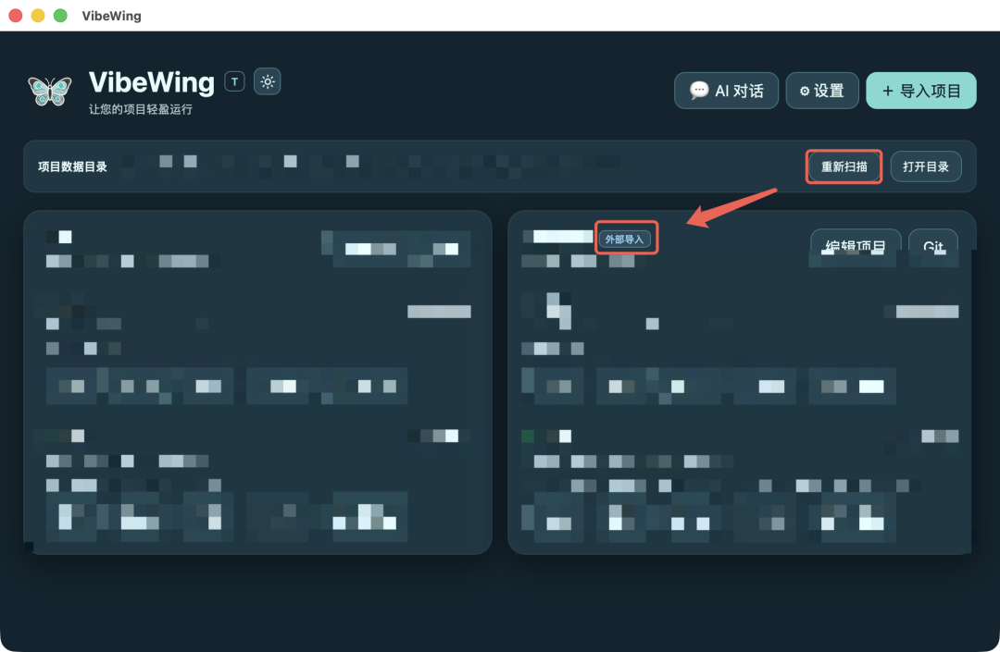

## 构建脚本识别

构建前端时，VibeWing 会按以下顺序检测脚本：

| 环境 | 检测的脚本 |
| --- | --- |
| 生产环境 | `build:prod`、`build:production`、`build` |
| 测试环境 | `build:test`、`build:staging`、`test:build` |

VibeWing 会根据锁文件推断包管理器（pnpm、Yarn、Bun 或 npm）。构建产物仍保存在项目自身构建配置指定的位置。

## 数据、隐私与安全

VibeWing 的本地后端只监听 `127.0.0.1`，并使用每次启动时随机生成的令牌保护本地 API。

应用数据按用户保存在：

- macOS：`~/Library/Application Support/VibeWing`
- Windows：`%APPDATA%\VibeWing`

项目配置、设置、对话和日志默认保留在本机。只有当你明确把项目上下文或日志发送给 AI 平台时，相关内容才会发送到你配置的平台地址，并受该平台的隐私与数据保留条款约束。

启用自动检查更新时，VibeWing 每天最多访问一次公开的 GitHub Releases API，仅用于获取最新稳定版本号和版本说明，不会发送项目数据。

macOS 上的 API Key 保存在钥匙串中。Windows 上的 Key 使用 Windows 数据保护 API（DPAPI）为当前 Windows 用户加密，并会在 VibeWing 重启后继续保留。配置导出不会包含 API Key。

日志可能包含私人源码路径、环境输出、URL，或项目打印的访问令牌。在发送给 AI 平台或分享到 Issue 之前，请检查并脱敏选中的日志。

VibeWing 可以在本地仓库中执行配置好的终端命令和 Git 操作。请只导入可信项目，并在运行前检查命令。

## 常见问题

### 服务无法启动

- 确认配置的工作目录真实存在。
- Windows 上请填写包含盘符的完整绝对路径，例如 `D:\Projects\MyApp`。
- 对于 npm、pnpm、Yarn 或 Bun 命令，确认对应目录包含 `package.json`。
- 如果项目尚未安装依赖，请先执行一次项目自己的依赖安装命令。
- 打开 **查看日志**，检查命令、退出码和错误输出。
- 确认配置的端口没有被其他进程占用。

### 无法构建

检查前端 `package.json` 是否包含[构建脚本识别](#构建脚本识别)中列出的脚本。VibeWing 不会自动发明或修改项目的构建脚本。

### AI 请求失败或响应缓慢

- 检查平台 URL、API Key 和准确的模型 ID。
- 确认模型仍然存在并支持 Chat Completions。
- 当平台返回 `410`、`502`、`503` 或 `504` 时，尝试切换其他模型。
- 推理模型在输出可见内容前可能需要更长时间。

### Git 推送失败

- 确认仓库存在 `origin` 远端。
- 确认 Git 凭据助手或 SSH Key 在 VibeWing 外也能正常使用。
- 如果远端分支已有新提交，请先拉取最新代码。

## 参与开发

环境要求：

- Node.js 22 或更高版本
- Python 3.12 或更高版本
- Git

```bash
git clone https://github.com/Grakie93/VibeWing.git
cd VibeWing
npm ci
python3 -m pip install -r requirements-build.txt
npm start
```

本地开发数据文件已被 Git 忽略。请勿强制提交 `projects.json`、`settings.json`、`chats.json`、`logs/`、`.env` 文件、证书或签名密钥。

## 构建桌面安装包

请在对应目标操作系统上构建：

```bash
# macOS
npm run dist:mac

# Windows
npm run dist:win
```

产物会输出到 `dist/`。安装包中包含使用 PyInstaller 构建的本地后端，因此最终用户不需要为了运行 VibeWing 安装 Python。

## 参与贡献

欢迎提交 Issue 和 Pull Request。报告 Bug 时请包含：

- 操作系统和 VibeWing 版本。
- 项目类型和包管理器。
- 复现步骤和预期行为。
- 已移除凭据、访问令牌、私有 URL 和个人路径的脱敏日志。

提交变更前请阅读 [CONTRIBUTING.md](CONTRIBUTING.md)。所有贡献均按照仓库的 MIT License 接收。

## 社区与支持

- 使用 [GitHub Discussions](https://github.com/Grakie93/VibeWing/discussions) 交流想法、提出问题和反馈建议。
- 使用 [GitHub Issues](https://github.com/Grakie93/VibeWing/issues) 报告可复现的 Bug 和已确认的功能需求。
- 提交 Pull Request 前请阅读 [CONTRIBUTING.md](CONTRIBUTING.md)。
- 敏感安全问题请通过 GitHub 私有漏洞报告渠道提交。
- 联系邮箱：[grakie93@gmail.com](mailto:grakie93@gmail.com)。

## 许可证

VibeWing 源代码使用 [MIT License](LICENSE)。

Copyright © 2026 Grakie93。MIT 许可证适用于源代码，但不代表可以将非官方 Fork 冒充为 VibeWing 官方产品。请参阅[品牌使用规范](BRAND_GUIDELINES.md)。第三方组件继续适用各自的许可证，详情见[第三方声明](THIRD_PARTY_NOTICES.md)。
